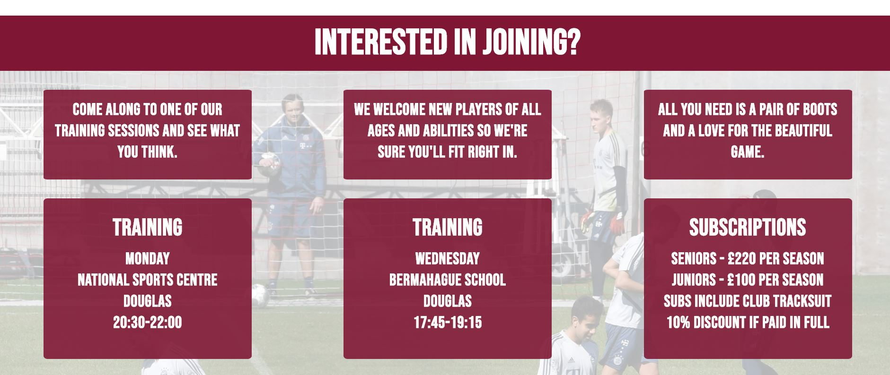

# Milestone project one - Union Mills FC

Union Mills Football club is football team from the Isle of Man who currently compete in the men's 2nd Division. In addition to football, the club ground becomes a temporary campsite during the Isle of Man Tourist Trophy (TT) motorcycle festival (June) and the Manx Grand Prix (September) as tens of thousands of motorcycle enthusiasts come to the island and opt to camp, rather than book hotels (as it is considerably cheaper).

To ensure the club always has a strong squad of players, and that the club stays financially stable, a new website is required to try and attract new players to the club and encourage existsing players to stay as all players pay subscriptions which provides valuable income to the club.

The website also would provide details of the campsite and a form to complete which facilitates booking of a camping lot. The camping provides a signifcant amount of income for the club and so a good website is key to attacting potential campers and making it easy to book a space.

[Click here to view the live website](https://howler118.github.io/milestone-project-one)

# User Experience
## User stories
#### External Users 

- Members of Union Mills Football club
- Football players who are non-members
- Tourists visiting Isle of Man for TT Motorbike festival

#### External User Goals

- UMFC Members
    - As a member, I want to easily find the fixture list so I know what games are coming up
    - As a member, if I wasn't present at the last game (or a specific match) I want to be able to see the results of all our matches
    - As a member, I want to see the current league table to see how the team is performing
    - As a member I want to know what time training takes place and the location (as it can change throughout the season)

- Football players who are non-members
    - As a footballer looking to join the club, I want to know about when and where training takes place
    - As a footballer looking to join the club, I want to know about the price of subscriptions
    - As a footballer looking to join the club, I would be interesting to know about the club's history
    - As a footballer looking to join the club, I want to know where the club is 

- Tourists visiting IoM for TT festival
    - As a TT camper, I want to know what facilities are available at the UMFC campsite
    - As a TT camper, I want to know how much it costs to camp at the UMFC campsite
    - As a TT camper, I enquire about availability
    - As a TT camper, I want to know how to find the campsite

#### Site Owner Goals

- As the site owner, I want to generate income to sustain the club
- As the site owner, I want to attract more players to the club

# Design

Colour Scheme

- The main colours used for the website were claret and white. Claret is the main colour on the UMFC football kit so it was important that it was a prominent color to be used throughout the website. Initially I used light cyan as the accompanying colour as it is the other colour on the UMFC football kit. However when it was used as the background colour, the claret coloured paragraph text was not easy to read so I opted to use white as the second colour. Light cyan was still used for the header.

Typography

- For the headings I used Bebas Neue. I came accross it after cyling through many fonts on Google Fonts. It is quite a striking font mostly due to being capitalised and works well as the font for headings. One of the suggested pairings (from Google Fonts) was Montserrat which worked well for the paragraphs of text so I decided to use it.

Imagery

- The images used were vital to the UX as they tell the user what the website (or specific page) is about without them having to read through the text. This is perhaps slightly less important for returning users who already know what the website/page is about. New users do not want to read all the text on a page to just to understand what the website is about.On the home page the first image you see is the large image of the football and football boot in the welcome section which instantly tells the user its a football website. On the TT camping page the first image you see is the motorcyclist so this would assure the site visitors looking for TT camping that they are in the right place.

 Wireframes

- The Wireframes for the website are available to view in the repository

# Features

### Existing Features
- YouTube video on the home page showing a highlight from UMFC 2011-12 season
- Form on the TT camping page which allows users to submit booking enquiries
- Form on the contact us page which allows users to submit feedback on the website
- The website is responsive and works on all devices
- A banner link which takes the user to the clubshop where they can buy UMFC training gear
- Links to the UMFC sponsor websites
- Link to the Isle of Man Football Association website

### Features left to implement

- A gallery page with lots of photos of UMFC players and matches, past and present
- A page for hiring out the clubhouse including a form to submit booking inquiries
- A page that provides information on the Union Mills Cricket team (page would be similar to index.html)

# Technologies Used

### Languages Used

- HTML5
- CSS3

### Frameworks, Libraries and Programs Used

- Google Fonts:

Google fonts were used on all pages on my website. I imported two fonts "Bebas Neue" which was used for headings and "Montserrat" which was used for paragraphs.

- Font Awesome:

Font awesome was used throughout my website to add icons to various headings to make them stand out more and look different from one and other.

- Git

Git was used for version control (using the Gitpod terminal)

- Github

Github was used to store the project

- Balsamiq

Was used to create my wireframes for the project

# Testing

## Code Validation

Initially I wanted to make sure that all syntax used was valid on my website so used the [W3C Markup Validator](https://validator.w3.org/#validate_by_input) and [W3C CSS Validator](https://jigsaw.w3.org/css-validator/#validate_by_input) respectively.

#### Upon checking my CSS file got three errors:

1) 257	#welcome_background	Value Error : background-color none is not a background-color value : none
2) 302	hr	Value Error : width only 0 can be a unit. You must put a unit after your number : 1005
3) 425	#about-outer hr	Value Error : width only 0 can be a unit. You must put a unit after your number : 1005

I removed the background-color styling which cleared the error on line 257. I made sure to check if removing created any issues or negatively affected the user experience in the welcome section on index.html. Removing it cleared the error and had no impact on the welcome section on index.html.

Errors 2 and 3 were caused by the number "5" at the end of a width value instead of "%". I changed this and this cleared the errors.

My CSS file was was now free of errors

#### Upon checking index.html got eight errors:

1) The center element is obsolete. Use CSS instead. From line 95, column 17; to line 95, column 24
2) Element p not allowed as child of element b in this context. (Suppressing further errors from this subtree.) From line 143, column 24; to line 143, column 26
3) Element b not allowed as child of element ol in this context. (Suppressing further errors from this subtree.) From line 156, column 25; to line 156, column 27
4) Element p not allowed as child of element b in this context. (Suppressing further errors from this subtree.) From line 175, column 24; to line 175, column 26
5) Element p not allowed as child of element b in this context. (Suppressing further errors from this subtree.) From line 185, column 24; to line 185, column 26
6) Element b not allowed as child of element ol in this context. (Suppressing further errors from this subtree.) From line 195, column 25; to line 195, column 27
7) Error: Attribute alt not allowed on element a at this point. From line 259, column 21; to line 259, column 198
8) Element h2 not allowed as child of element ul in this context. (Suppressing further errors from this subtree.) From line 279, column 17; to line 279, column 20

Error 1 was caused by using the center tag to align the embedded video centrally rather than using styling rules within my CSS file. To clear the error I removed the center tag and in my CSS file I applied a margin-left of 30% to align the video in the center of the section.

Errors 2-6 were all caused by the bold tag occuring before the paragraph tags or list tags in the About the club section. I moved the bold tags inside the paragraph tags or list tags which cleared the errors.

Error 7 was caused by adding an alt attribute to an anchor tag which isn't required in the club shop banner section. I removed this tag which cleared the error.

Error 8 I had difficulty clearing. If I removed the h2 element it created alignment issues with the text and social media icons. To solve the alignment issues I created a new div that would contain the h2 and this helped align the h2 with the social media links

#### Upon checking camping.html got four errors:

1) Element br not allowed as child of element ul in this context. (Suppressing further errors from this subtree.) From line 81, column 21; to line 81, column 24
2) Element p not allowed as child of element ul in this context. (Suppressing further errors from this subtree.) From line 82, column 21; to line 82, column 23
3) Error: Attribute alt not allowed on element a at this point. From line 160, column 21; to line 160, column 198
4) Element h2 not allowed as child of element ul in this context. (Suppressing further errors from this subtree.) From line 180, column 17; to line 180, column 20

Error 1 was caused by a line break tag being inside an an unordered list. I moved the line break tag below the unordered list which cleared the error and had no impact on page.

Error 2 was caused by a paragraph tag being inside an an unordered list. I moved the paragraph tag below the unordered list which cleared the error and had no impact on page.

Error 3 was caused by adding an alt attribute to an anchor tag which isn't required in the club shop banner section. I removed this tag which cleared the error.

Error 4 I had difficulty clearing. If I removed the h2 element it created alignment issues with the text and social media icons. To solve the alignment issues I created a new div that would contain the h2 and this helped align the h2 with the social media links

Upon checking contact.html got two errors:

1) Error: Attribute alt not allowed on element a at this point. From line 151, column 21; to line 151, column 198
2) Element h2 not allowed as child of element ul in this context. (Suppressing further errors from this subtree.) From line 171, column 17; to line 171, column 20

Error 1 was caused by adding an alt attribute to an anchor tag which isn't required in the club shop banner section. I removed this tag which cleared the error.

Error 2 I had difficulty clearing. If I removed the h2 element it created alignment issues with the text and social media icons. To solve the alignment issues I created a new div that would contain the h2 and this helped align the h2 with the social media links

## Live Website Testing

Thorough testing was done on the live website on laptop/pc, mobile and tablet device screensizes. The testing undertaken is listed below.

1) Navigation between pages (from the home page)
    - TT Camping page
        - When on the home page, I clicked on the TT camping page link in the navigation bar at the top to see if the user is taken to the the TT Camping page.
        - The user is taken to the TT camping page as expected
    
    - Contact Us page
        - When on the home page, I clicked on the Contact Us page link in the navigation bar at the top to see if the user is taken to the the Contact Us page.
        - The user is taken to the Contact Us page as expected

2) Navigation between pages (from the TT Camping page)
    - Home page (via Home in the navigation bar)
        - When on the TT Camping page, I clicked on the Home page link in the navigation bar at the top to see if the user is taken to the the Home page.
        - The user is taken to the Home page as expected
    
    - Home page (via UMFC logo in the navigation bar)
        - When on the TT Camping page, I clicked on the UMFC logo on the left hand side of the navigation bar to see if the user is taken to the the Home page.
        - The user is taken to the Home page as expected

    - Home page (via Union Mills Football Club text in the navigation bar)
        - When on the TT Camping page, I clicked on the Union Mills Football Club text on the left hand side of the navigation bar to see if the user is taken to the the Home page.
        - The user is taken to the Home page as expected
    
    - Contact Us page
        - When on the TT Camping page, I clicked on the Contact Us page link in the navigation bar at the top to see if the user is taken to the the Contact Us page.
        - The user is taken to the Contact Us page as expected

3) Navigation between pages (from the Contact Us page)
    - Home page (via Home in the navigation bar)
        - When on the Contact Us page, I clicked on the Home page link in the navigation bar at the top to see if the user is taken to the the Home page.
        - The user is taken to the Home page as expected
    
    - Home page (via UMFC logo in the navigation bar)
        - When on the Contact Us page, I clicked on the UMFC logo on the left hand side of the navigation bar to see if the user is taken to the the Home page.
        - The user is taken to the Home page as expected

    - Home page (via Union Mills Football Club text in the navigation bar)
        - When on the Contact Us page, I clicked on the Union Mills Football Club text on the left hand side of the navigation bar to see if the user is taken to the the Home page.
        - The user is taken to the Home page as expected
    
    - TT Camping page
        - When on the Contact Us page, I clicked on the TT Camping page link in the navigation bar at the top to see if the user is taken to the the TT Camping page.
        - The user is taken to the TT Camping page as expected

4) Clubshop Banner Link
    - Home Page
        - On the Home page, I scrolled to the bottom of the page.
        - clicked on the clubshop banner just above the Footer
        - the clubshop website opens in a new tab as expected

    - TT Camping Page
        - On the TT Camping page, I scrolled to the bottom of the page.
        - clicked on the clubshop banner just above the Footer
        - the clubshop website opens in a new tab as expected

    - Contact Us Page
        - On the Contact Us page, I scrolled to the bottom of the page.
        - clicked on the clubshop banner just above the Footer
        - the clubshop website opens in a new tab as expected

5) Footer Links

    - Home page
        - On the Home page, I scrolled to the bottom of the page
        - clicked on the Nike logo in the footer which opened in a new tab as expected
        - clicked on the Quayside Tyres logo in the footer which opened in a new tab as expected
        - clicked on the Isle of Man Football Association logo in the footer which opened in a new tab as expected
        - clicked on the Instagram logo in the footer which opened in a new tab as expected
        - clicked on the YouTube logo in the footer which opened in a new tab as expected
        - clicked on the Twitter logo in the footer which opened in a new tab as expected
        - clicked on the Facebook logo in the footer which opened in a new tab as expected

    - TT Camping page
        - On the TT Camping page, I scrolled to the bottom of the page
        - clicked on the Nike logo in the footer which opened in a new tab as expected
        - clicked on the Quayside Tyres logo in the footer which opened in a new tab as expected
        - clicked on the Isle of Man Football Association logo in the footer which opened in a new tab as expected
        - clicked on the Instagram logo in the footer which opened in a new tab as expected
        - clicked on the YouTube logo in the footer which opened in a new tab as expected
        - clicked on the Twitter logo in the footer which opened in a new tab as expected
        - clicked on the Facebook logo in the footer which opened in a new tab as expected

    - Contact Us page
        - On the Contact Us page, I scrolled to the bottom of the page
        - clicked on the Nike logo in the footer which opened in a new tab as expected
        - clicked on the Quayside Tyres logo in the footer which opened in a new tab as expected
        - clicked on the Isle of Man Football Association logo in the footer which opened in a new tab as expected
        - clicked on the Instagram logo in the footer which opened in a new tab as expected
        - clicked on the YouTube logo in the footer which opened in a new tab as expected
        - clicked on the Twitter logo in the footer which opened in a new tab as expected
        - clicked on the Facebook logo in the footer which opened in a new tab as expected

6) Latest team information section links
    - On the Home page, below the welcome section, the user comes accross the Latest Team Information section.
    - The section contains four subsections, each with an external link:
    - Last match section
        - In the last match subsection I clicked on the link where it says "click here"
        - The link opens in a new tab and takes the user to the FA Full-time website and the user is presented with the list of results for the current football season
        - It worked as expected

    - Next match section
        - In the next match subsection I clicked on the link where it says "click here"
        - The link opens in a new tab and takes the user to the FA Full-time website and the user is presented with the list of fixtures for the current football season
        - It worked as expected

    - Football news section
        - In the Football news subsection I clicked on the link where it says "click here"
        - The link opens in a new tab and takes the user to the Isle of Man Today website and the user is presented with the latest football news stories from the Isle of Man
        - It worked as expected

    - League table section
        - In the league table subsection I clicked on the link where it says "click here"
        - The link opens in a new tab and takes the user to the FA Full-time website and the user is presented with the league table for the current football season
        - It worked as expected

7) Embedded youtube video
    - On the Home page, the user scrolls down past the Latest Team Information and they reach the From the Vault section
    - The section contains a embedded video from youtube
    - The video does not play automatically as expected
    - After clicking on the play button in the center of the video, the video start playing with sound as expected

8) Booking Form
    - From the home page, I clicked on the TT Camping navigation link in the header
    - Once on the TT Camping page, I scrolled down to the Booking section which contains the form where users can submit booking enquiries
    - Just above the form, there is a link in the text which the user can click on if they want to get in touch with someone from UMFC
    - I clicked the link and was taken directly to the contact page as expected
    - Before inputting any information, I pressed the submit button at the bottom of the form which brought up an error asking the user to fill out the first name field
    - This was as expected as it is a mandatory field
    - I input some text into this field only and tried to submit again which brought up an error asking the user to fill out the surname field
    - This was as expected as it is a mandatory field
    - I input some text into this field and tried to submit again which brought up an error asking the user to fill out the email field
    - This was as expected as it is a mandatory field
    - I input some text into this field and tried to submit again which brought up an error specifying that the '@' symbol was missing
    - This was as expected as the field has a specific format with the email address expected to contain the '@' symbol
    - I added the symbol and submitted again
    - This time the form submits successfully and the user is taken to booking.html which advises the user's booking enquiry has been sucessfully received
    - This was as expected as there were no other mandatory fields in the booking form

9) booking.html
    - After testing the booking form, the user lands on booking.html which advises the user that they have successfully submitted their booking enquiry
    - The user is presented with two links:
        - I clicked the 'get in touch' link and was taken to the contact page where the clubs contact details are listed. This was as expected.
        - I completed the form again, this time clicking the 'back to home page' link and was taken to the home page as expected.

10) Contact Us Form

    - From the home page, I clicked on the Contact Us navigation link in the header
    - Once on the Contact Us page, I scrolled down to the Website Feedback section which contains the form where users can submit feedback or issues with the website
    - Before inputting any information, I pressed the submit button at the bottom of the form which brought up an error asking the user to fill out the 'your issue/feedback' field
    - This was as expected as it is a mandatory field
    - I input some text into this field only and tried to submit again which brought up an error asking the user to fill out the description field
    - This was as expected as it is a mandatory field
    - I input some text into this field and tried to submit again which brought up an error asking the user to fill out the email field
    - This was as expected as it is a mandatory field
    - I input some text into this field and tried to submit again which brought up an error specifying that the '@' symbol was missing
    - This was as expected as the field has a specific format with the email address expected to contain the '@' symbol
    - I added the symbol and submitted again
    - This time the form submits successfully and the user is taken to feedback.html which advises the user's feedback enquiry has been sucessfully received
    - This was as expected as there were no other mandatory fields in the feedback form

11) feedback.html
    - After testing the feedback form, the user lands on feedback.html which advises the user that they have successfully submitted their website feedback
    - The user is presented with two links:
        - I clicked the 'get in touch' link and was taken to the contact page where the clubs contact details are listed. This was as expected.
        - I completed the form again, this time clicking the 'back to home page' link and was taken to the home page as expected.

# Testing User Stories from User Experience (UX) Section

## UMFC Members

#### 1) As a member, I want to easily find the fixture list so I know what games are coming up
- Upon entering the site, the user automatically lands on the "Home" page.

  

  

- Underneath the welcome picture of the football and football boot is the latest team information section
- The users are presented with four subsections: last match, next match, football news and league table which are clearly labelled and separated

  

  

- The users can see the "Next Match" subsection and click where it says "click here" and a new tab opens which takes users to the Isle of Man Football Association website
- The users are then presented with an up to date fixture list for the current season

  

  

#### 2) As a member, if I wasn't present at the last game (or a specific match) I want to be able to see the results of all our matches
- Upon entering the site, the user automatically lands on the "Home" page.

  

  

- Underneath the welcome picture of the football and football boot is the latest team information section
- The users are presented with four subsections: last match, next match, football news and league table which are clearly labelled and separated

  

  

- The users can see the "Last Match" subsection and click where it says "click here" and a new tab opens which takes users to the Isle of Man Football Association website
- The users are then presented with all of the season results to date

  

  

#### 3) As a member, I want to see the current league table to see how the team is performing
- Upon entering the site, the user automatically lands on the "Home" page.

  

  

- Underneath the welcome picture of the football and football boot is the latest team information section
- The users are presented with four subsections: last match, next match, football news and league table which are clearly labelled and separated

  

  

- The users can see the "League table" subsection and click where it says "click here" and a new tab opens which takes users to the Isle of Man Football Association website
- The users are then presented with an up to date league table for the current season

  

  

#### 4) As a member I want to know what time training takes place and the location (as it can change throughout the season)
- Upon entering the site, the user automatically lands on the "Home" page.

  

  

- The users scroll to the bottom of the page where they come accross the join section

  

  

- Although UMFC members are already part of the club, the join section lists the training time and location
- The users can check back to this section to see if the training times/location changes
---
## Football players who are non-members

#### 1) As a footballer looking to join the club, I want to know about when and where training takes place
- Upon entering the site, the user automatically lands on the "Home" page.

  

  

- The users scroll to the bottom of the page where they come accross the clearly marked join section

  

  

- The join section give details of the training times so the user know when and where to go
- If the user is unsure on anything they can go to the contact us page via the navigation bar at the top and they immediately see various contact information

#### 2) As a footballer looking to join the club, I want to know about the price of subscriptions
- Upon entering the site, the user automatically lands on the "Home" page.

  

  

- The users scroll to the bottom of the page where they come accross the clearly marked join section

  

  

- The join section clearly lists the amount it costs to become member of the club
- If the user is a parent looking for a club for their child, the join section also lists the membership (subscription) cost for junior players too
- If the user is unsure on anything they can go to the contact us page via the navigation bar at the top and they immediately see various contact information

  

  

#### 3) As a footballer looking to join the club, I would be interesting to know about the club's history
- Upon entering the site, the user automatically lands on the "Home" page.

  

  

- The user does not have to scroll down the home page far before they come accross the clear labelled "About the Club" section
- The section provides key information from the history of the club so the user does not have to read pages and pages of information to understand the sucess the club has had and any club records

  

  

#### 4) As a footballer looking to join the club, I want to know where the club is 
- Upon entering the site, the user automatically lands on the "Home" page.

  

  

- Users use the navigation bar at the top to nagivate to the "Contact Us" page

  

  

- The user scrolls down to the clearly labelled "How to find us" section
- The user is presented with a map of Douglas (courtesy of Google Maps) to help the user find the ground in relation to Douglas town center

  

  
---
## Tourists visiting IoM for TT festival

#### 1) As a TT camper, I want to know what facilities are available at the UMFC campsite
- Upon entering the site, the user automatically lands on the "Home" page.

  

  

- In the navigation bar at the top, the users can clearly see the link to the "TT Camping" page
- After clicking on the "TT Camping" page, the user knows they are in the correct place as they are presented with some text urging them to book their stay and a picture of a TT race competitor 

  

  

- The user scrolls down till they reach the "Camping information" section
- This section lists the facilities available to campers at the UMFC camp site
  

  

#### 2) As a TT camper, I want to know how much it costs to camp at the UMFC campsite
- Upon entering the site, the user automatically lands on the "Home" page.

  

  

- In the navigation bar at the top, the users can clearly see the link to the "TT Camping" page
- After clicking on the "TT Camping" page, the user knows they are in the correct place as they are presented with some text urging them to book their stay and a picture of a TT race competitor

  

  

- The user scrolls down till they reach the "Camping information" section
- This section lists the prices of booking a stay a the UMFC camp site

  

  

#### 3) As a TT camper, I enquire about availability
- Upon entering the site, the user automatically lands on the "Home" page.

  

  

- In the navigation bar at the top, the users can clearly see the link to the "TT Camping" page
- After clicking on the "TT Camping" page, the user knows they are in the correct place as they are presented with some text urging them to book their stay and a picture of a TT race competitor

  

  

- The user scrolls down till they reach the "Booking" section

  

  

- The user is presented with a form to complete and submit
- Upon completing the form correctly the user will land on another confirming they have successfully submitted an booking enquiry
- If the user has any queries they can click on the link that will take the users to the "Contact Us" page where they are presented with different methods for contacting people from the club

    

  

#### 4) As a TT camper, I want to know how to find the campsite
- Upon entering the site, the user automatically lands on the "Home" page.

  

  

- In the navigation bar at the top, the users can clearly see the link to the "Contact Us" page

  

  

- The user scrolls down to the clearly labelled "How to find us" section

  

  

- The user is presented with a map of Douglas (courtesy of Google Maps) to help the user find the ground in relation to Douglas town center

# Further Testing

1) The website was tested on three different internet browsers
    - Google Chrome
    - Microsoft Edge
    - Internet Explorer 11

2) All links on the website were clicked on to make sure they work as expected. All links opened as expected.

3) The website was viewed (all pages) on various mobile and tablet devices by using the Inspect feature. The following devices were tested
    - Moto G4
    - Galaxy S5
    - Pixel 2
    - Pixel 2L
    - iPhone 5/SE
    - iPhone 6/7/8
    - iPhone 6/7/8 plus
    - iPhone X 
    - iPad
    - iPad Pro
    - Surface Duo
    - Galaxy Fold

4) The website was tested on an actual iPhone 6 in addition to laptop/PC. 

# Known Bugs

1) When opening the live website on Internet Explorer 11, the background picture in the Welcome section on the home page appears stretched
2) When viewing the "Contact Us" page on Microsoft Edge, there does not appear to be any gap/margin between the map and the text underneath

# Deployment
#### GitHub Pages
The following steps were taken to deploy the project in Github Pages
1) Logged into Github
2) Went to the repository for my milestone project one
3) Clicked on settings
4) Scrolled down to GitHub pages
5) Underneath the "source" heading, change "none" to "master" and click save.
6) After saving refresh the page (if it does not automatically) and then the link to the live website will be available

#### Local Deployment
The following steps were taken to download a copy of the repository to my desktop
1) Logged into GitHub
2) Navigated to the repository for this project, 'howler118/milestone-project-one'
3) Clicked on the green code button and copied the url for the repository
4) Opened git bash
5) changed the director to my milestone one project folder on my pc
6) Enter git clone and pasted the url for my repository
7) Once the download was completed I checked the porject folder on my pc and the repository downloaded as expected

# Credits

#### Code

- css-tricks.com - was used when I had issues styling background images. I was trying to add background images and reduce the opacity value but I could not get it to work initially. 
- w3schools.com - used to quickly look up various element tags
- Code Institute for the course materials and general support
- stackoverflow - was used to see if other programmers were having similar problems with certain syntax. For example, initially I was struggling to position elements centrally within their container with "margin: 0 auto;". I could not figure out why it was not working as expected. I used stackover to see if other people faced a similar problem and what the common causes of this were.

#### Content
    
All content was written by the developer

#### Media

- The football and football boot image in the welcome section came from this [link](https://www.google.com/search?q=soccer+wallpapers&rlz=1C1CHBF_enIM911IM911&tbm=isch&source=iu&ictx=1&fir=vRYNl1mCYq6KrM%252COWUyXBn7TWteqM%252C_&vet=1&usg=AI4_-kTKYGZXgO0X8iQCMyfmV4CHuMh3EA&sa=X&ved=2ahUKEwiXhuSdtOPrAhVjlFwKHdw-AUAQ9QF6BAgKEF0&biw=1920&bih=937#imgrc=vRYNl1mCYq6KrM) 
- The training image in the join section came from this [link](https://www.google.com/search?q=football+training+bayern&tbm=isch&ved=2ahUKEwjB9qfyrePrAhXZ44UKHSHJBjYQ2-cCegQIABAA&oq=football+training+bayern&gs_lcp=CgNpbWcQAzoCCAA6BggAEAgQHlCvzwJYytMCYP3UAmgAcAB4AIABZYgB8wOSAQM1LjGYAQCgAQGqAQtnd3Mtd2l6LWltZw&sclient=img&ei=MJxcX8GeOtnHlwShkpuwAw&safe=images&tbs=isz%3Alt%2Cislt%3Axga&hl=en-US#imgrc=oRzdLxj-eH0dsM)
- The embedded video came from Paul Hatton's YouTube channel [link](https://www.youtube.com/watch?v=HCESTyQ0C4I)
- The background image in the from the vault section came from the UMFC private Facebook page
- The UMFC logo used throughout the website came from the UMFC private Facebook page
- Nike logo came from [here](https://www.google.com/search?q=nike+logo&rlz=1C1CHBF_enIM911IM911&source=lnms&tbm=isch&sa=X&ved=2ahUKEwj1wd6gwePrAhUKSBUIHbDzCnEQ_AUoAXoECBcQAw&biw=1920&bih=937#imgrc=_hxr4mhS9IAILM)
- Quayside Tyres logo came from [here](https://www.google.com/search?q=quayside+tyres&rlz=1C1CHBF_enIM911IM911&source=lnms&tbm=isch&sa=X&ved=2ahUKEwju2fO8wePrAhXpShUIHcGtASYQ_AUoAXoECBsQAw&biw=1920&bih=937#imgrc=6gcYgEqqfL7FkM)
- Isle of Man Football Association logo came from [here](https://www.google.com/search?q=iom+fa&rlz=1C1CHBF_enIM911IM911&source=lnms&tbm=isch&sa=X&ved=2ahUKEwjPlKbZwePrAhU5SxUIHWqzCbYQ_AUoAXoECB8QAw&biw=1920&bih=937#imgrc=Q5JKrVfSZzA43M)
- TT photo on the TT Camping page came from [here](https://www.google.com/search?q=iom+tt&rlz=1C1CHBF_enIM911IM911&source=lnms&tbm=isch&sa=X&ved=2ahUKEwi_u5bmueTrAhUDWhUIHZNVBgoQ_AUoAXoECB8QAw&biw=1920&bih=937#imgrc=PcaPAkRMfxGImM)
- The picture of the UMFC clubhouse came from the UMFC private Facebook page
- Map of Douglas (on the contact us page, how to find us section) was as screenshot from Google Maps

#### Acknowledgements

- My mentor for the feedback throughout the project at each mentor session
- Code Institute for the course materials and general support
- Union Mills Football Club for the use of the logo and other media
- Paul Hatton for the use of his UMFC video on YouTube
- Manchester United FC website (manutd.com) - gave me the idea for adding a website feedback section to the contact us page