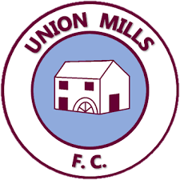

# Milestone project one - Union Mills FC

<!--INSERT LINK TO PROJECT-->

Union Mills Football club is football team from the Isle of Man who currently complete in the men's 2nd Division. In addition to football, the club ground becomes a temporary campsite during the Isle of Man Tourist Trophy (TT) motorcycle festival (June) and the Manx Grand Prix (September) as tens of thousands of motorcycle enthusiasts come to the island and opt to camp, rather than book hotels (as it is considerably cheaper).

To ensure the club always has a strong squad of players, and that the club stays financially stable, a new website is required to try and attract new players to the club and encourage existsing players to stay as all players pay subscriptions which provides valuable income to the club.

The website also would provide details of the campsite and a form to complete which facilitates booking of a camping lot. The camping provides a signifcant amount of income for the club and so a good website is key to attacting potential campers and making it easy to book a space.

---
## User Experience
---
## User stories
#### External Users 

- Members of Union Mills Football club
- Football players who are non-members
- Tourists visiting Isle of Man for TT Motorbike festival

#### External User Goals

UMFC Members

- As a member, I want to easily find the fixture list so I know what games are coming up
- As a member, if I wasn't present at the last game (or a specific match) I want to be able to see the results of all our matches
- As a member, I want to see the current league table to see how the team is performing
- As a member I want to know what time training takes place and the location (as it can change throughout the season)

Football players who are non-members

- As a footballer looking to join the club, I want to know about when and where training takes place
- As a footballer looking to join the club, I want to know about the price of subscriptions
- As a footballer looking to join the club, I would be interesting to know about the club's history
- As a footballer looking to join the club, I want to know where the club is 

Tourists visiting IoM for TT festival

- As a TT camper, I want to know what facilities are available at the UMFC campsite
- As a TT camper, I want to know how much it costs to camp at the UMFC campsite
- As a TT camper, I enquire about availability
- As a TT camper, I want to know how to find the campsite

#### Site Owner Goals

- As the site owner, I want to generate income to sustain the club
- As the site owner, I want to attract more players to the club

## Design

Colour Scheme

- The main colours used for the website were claret and white. Claret is the main colour on the UMFC football kit so it was important that it was a prominent color to be used throughout the website. Initially I used light cyan as the accompanying colour as it is the other colour on the UMFC football kit. However when it was used as the background colour, the claret coloured paragraph text was not easy to read so I opted to use white as the second colour. Light cyan was still used for the header.

Typography

- For the headings I used Bebas Neue. I came accross it after cyling through many fonts on Google Fonts. One of the suggested pairings (from Google Fonts) was Montserrat which worked well for the paragraphs of text so I decided to use it.

Imagery

- The images used were vital to the UX as they tell the user what the website (or specific page) is about without them having to read through the text. This is perhaps slightly less important for returning users who already know what the website/page is about. New users do not want to read all the text on a page to just to understand what the website is about.On the home page the first image you see is the large image of the football and football boot in the welcome section which instantly tells the user its a football website. On the TT camping page the first image you see is the motorcyclist so this would assure the site visitors looking for TT camping that they are in the right place.

## Wireframes

--------

## Features

### Existing Features
- YouTube video on the home page showing a highlight from UMFC 2011-12 season
- Form on the TT camping page which allows users to submit booking enquiries
- Form on the contact us page which allows users to submit feedback on the website
- The website is responsive and works on all devices
- A banner link which takes the user to the clubshop where they can buy UMFC training general
- Links to the UMFC sponsor websites
- link to the Isle of Man Football Association website

### Features left to implement

- A gallery page with lots of photos of UMFC players and matches, past and present
- A page for hiring out the clubhouse including a form to submit booking inquiries

--------

## Technologies Used

#### Languages Used

- HTML5
- CSS3

#### Frameworks, Libraries and Programs Used

- Google Fonts:

Google fonts were used on all pages on my website. I imported two fonts "Bebas Neue" which was used for headings and "Montserrat" which was used for paragraphs.

- Font Awesome:

Font awesome was used throughout my website to add icons to various headings to make them stand out more and look different from one and other.

- Git

Git was used for version control (using the Gitpod terminal)

- Github

Github was used to store the project

- Balsamiq

Was used to create my wireframes for the project

--------
--------
## Testing

### Testing User Stories from User Experience (UX) Section

### Further Testing

### Known Bugs
--------
## Deployment

--------
## Credits

### Code

- Code Insitute course content and modules were 
- w3schools was used to quickly look up 

### Content
    
how to resize background image?

### Media

- The football and boot image in the welcome section came from this [link](https://www.google.com/search?q=soccer+wallpapers&rlz=1C1CHBF_enIM911IM911&tbm=isch&source=iu&ictx=1&fir=vRYNl1mCYq6KrM%252COWUyXBn7TWteqM%252C_&vet=1&usg=AI4_-kTKYGZXgO0X8iQCMyfmV4CHuMh3EA&sa=X&ved=2ahUKEwiXhuSdtOPrAhVjlFwKHdw-AUAQ9QF6BAgKEF0&biw=1920&bih=937#imgrc=vRYNl1mCYq6KrM) 
- The training image in the join section came from this [link](https://www.google.com/search?q=football+training+bayern&tbm=isch&ved=2ahUKEwjB9qfyrePrAhXZ44UKHSHJBjYQ2-cCegQIABAA&oq=football+training+bayern&gs_lcp=CgNpbWcQAzoCCAA6BggAEAgQHlCvzwJYytMCYP3UAmgAcAB4AIABZYgB8wOSAQM1LjGYAQCgAQGqAQtnd3Mtd2l6LWltZw&sclient=img&ei=MJxcX8GeOtnHlwShkpuwAw&safe=images&tbs=isz%3Alt%2Cislt%3Axga&hl=en-US#imgrc=oRzdLxj-eH0dsM)
- The embedded video came from Paul Hatton's YouTube channel [link](https://www.youtube.com/watch?v=HCESTyQ0C4I)
- The background image in the from the vault section came from the UMFC private Facebook page
- The UMFC logo used throughout the website came from the UMFC private Facebook page
- Nike logo came from [here](https://www.google.com/search?q=nike+logo&rlz=1C1CHBF_enIM911IM911&source=lnms&tbm=isch&sa=X&ved=2ahUKEwj1wd6gwePrAhUKSBUIHbDzCnEQ_AUoAXoECBcQAw&biw=1920&bih=937#imgrc=_hxr4mhS9IAILM)
- Quayside Tyres logo came from [here](https://www.google.com/search?q=quayside+tyres&rlz=1C1CHBF_enIM911IM911&source=lnms&tbm=isch&sa=X&ved=2ahUKEwju2fO8wePrAhXpShUIHcGtASYQ_AUoAXoECBsQAw&biw=1920&bih=937#imgrc=6gcYgEqqfL7FkM)
- Isle of Man Football Association logo came from [here](https://www.google.com/search?q=iom+fa&rlz=1C1CHBF_enIM911IM911&source=lnms&tbm=isch&sa=X&ved=2ahUKEwjPlKbZwePrAhU5SxUIHWqzCbYQ_AUoAXoECB8QAw&biw=1920&bih=937#imgrc=Q5JKrVfSZzA43M)
- TT photo on the TT Camping page came from [here](https://www.google.com/search?q=iom+tt&rlz=1C1CHBF_enIM911IM911&source=lnms&tbm=isch&sa=X&ved=2ahUKEwi_u5bmueTrAhUDWhUIHZNVBgoQ_AUoAXoECB8QAw&biw=1920&bih=937#imgrc=PcaPAkRMfxGImM)
- The picture of the UMFC clubhouse came from the UMFC private Facebook page
- Map of Douglas (on the contact us page, how to find us section) was as screenshot from Google Maps

### Acknowledgements

- My mentor for the feedback throughout the project at each mentor session
- Code Institute for the course materials and general support
- css-tricks.com - was used when I had issues styling background images. I was trying to add background images and reduce the opacity value but I could not get it to work initially. 
- w3schools.com - used to quickley look up various element tags
- stackoverflow - was used to see if other programmers were having similar problems with certain syntax. For example, initially I was struggling to position elements centrally within their container with "margin: 0 auto;". I could not figure out why it was not working as expected. I used stackover to see if other people faced a similar problem and what the common causes of this were.
- Manchester United FC website (manutd.com) - gave me the idea for adding a website feedback section to the contact page
--------
--------
--------
--------
--------
--------
--------
--------

Welcome howler118,

This is the Code Institute student template for Gitpod. We have preinstalled all of the tools you need to get started. You can safely delete this README.md file, or change it for your own project.

## Gitpod Reminders

To run a frontend (HTML, CSS, Javascript only) application in Gitpod, in the terminal, type:

`python3 -m http.server`

A blue button should appear to click: *Make Public*,

Another blue button should appear to click: *Open Browser*.

To run a backend Python file, type `python3 app.py`, if your Python file is named `app.py` of course.

A blue button should appear to click: *Make Public*,

Another blue button should appear to click: *Open Browser*.

In Gitpod you have superuser security privileges by default. Therefore you do not need to use the `sudo` (superuser do) command in the bash terminal in any of the backend lessons.

## Updates Since The Instructional Video

We continually tweak and adjust this template to help give you the best experience. Here are the updates since the original video was made:

**April 16 2020:** The template now automatically installs MySQL instead of relying on the Gitpod MySQL image. The message about a Python linter not being installed has been dealt with, and the set-up files are now hidden in the Gitpod file explorer.

**April 13 2020:** Added the _Prettier_ code beautifier extension instead of the code formatter built-in to Gitpod.

**February 2020:** The initialisation files now _do not_ auto-delete. They will remain in your project. You can safely ignore them. They just make sure that your workspace is configured correctly each time you open it. It will also prevent the Gitpod configuration popup from appearing.

**December 2019:** Added Eventyret's Bootstrap 4 extension. Type `!bscdn` in a HTML file to add the Bootstrap boilerplate. Check out the <a href="https://github.com/Eventyret/vscode-bcdn" target="_blank">README.md file at the official repo</a> for more options.

--------

Happy coding!
